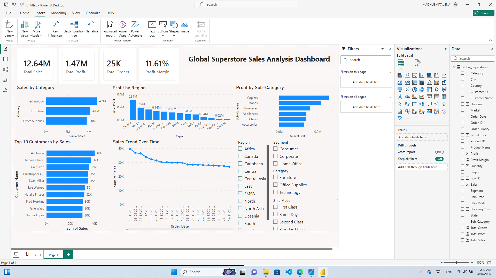

# Global Superstore Sales Analysis Dashboard

## Project Overview
This Power BI dashboard analyzes sales performance of a global superstore dataset. 
The dashboard provides insights into sales trends, profitability, customer behavior, and regional performance.

## Tools Used
- Power BI
- DAX
- Data Visualization
- Business Intelligence

## Key Metrics
- Total Sales
- Total Profit
- Total Orders
- Profit Margin

## Dashboard Insights
- Sales by product category
- Profit distribution by region
- Top customers contributing to revenue
- Sales trends over time
- Profitability by sub-category

## Dataset
Global Superstore dataset.

## Dashboard Preview

